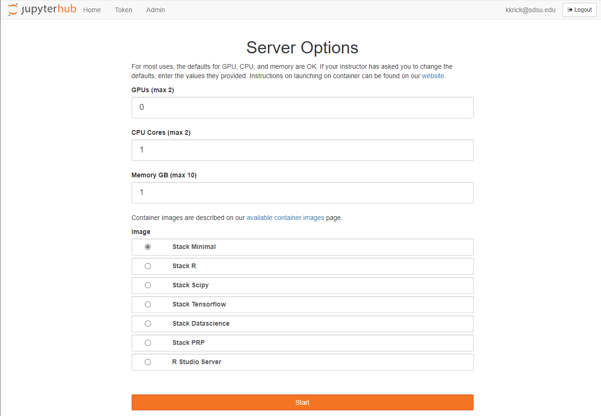

# 👋 Welcome to the Instructional Cluster Intro
This repository is designed to be an interactive introduction to the [Instructional Cluster](https://sdsu-research-ci.github.io/instructionalcluster) at San Diego State University.

This intro assumes that you are familiar with a [Linux Operating System](https://en.wikipedia.org/wiki/Linux) and have some level of comfort with commandline interfaces.

## 📅 Agenda
This introduction will cover the following topics:
1. Understanding Containers
2. Basics of git source control
3. Using Jupyter Notebooks

## 🔑 Accessing the Instructional Cluster
If you are following this introduction as part of a training offered by [Research and Cyberinfrastructure](https://it.sdsu.edu/research) chances are that you already have access to the Instructional Cluster.

You can check your access to the Instructional Cluster by following these [login instructions](https://sdsu-research-ci.github.io/instructionalcluster/students/loggingin).

If you are greeted by a screen similar to the following, then you have access!

If you don't have access and you are either SDSU Faculty or Staff, then you can submit [this form](https://sdsu.service-now.com/sp?id=sc_cat_item&sys_id=c4ce9d52db0e68509804f271399619a4&sysparm_category=29ac153fdbbf4c9024094672399619e9) to request access. Students will be granted access based on enrollment in courses that are using the Instructional Cluster.

## 🚀 Let's get started!
Now that we're cleared for take-off, let's launch on over to our first topic: [containers](/docs/containers)!