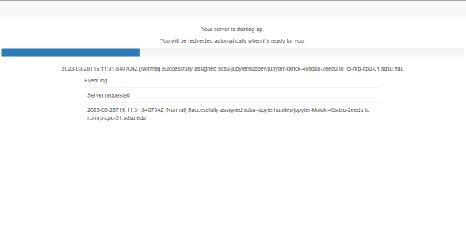
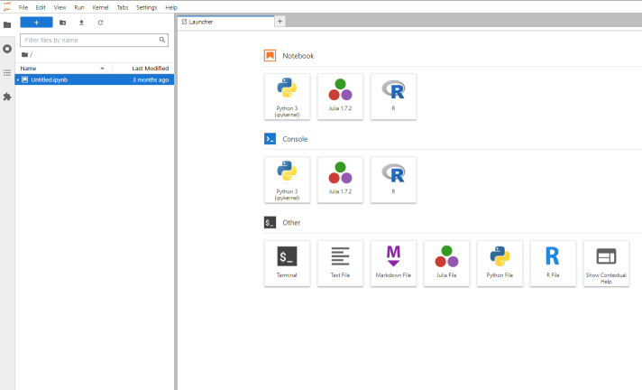
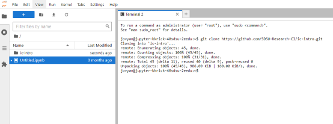

# 👋 Welcome to the Instructional Cluster Intro
This repository is designed to be an interactive introduction to the [Instructional Cluster](https://sdsu-research-ci.github.io/instructionalcluster) at San Diego State University.

This intro assumes that you are familiar with a [Linux Operating System](https://en.wikipedia.org/wiki/Linux) and have some level of comfort with commandline interfaces.

## 📅 Agenda
This introduction will cover the following topics:
1. Understanding Containers
2. Basics of git source control
3. Using Jupyter Notebooks

## 🔑 Accessing the Instructional Cluster
If you are following this introduction as part of a training offered by [Research and Cyberinfrastructure](https://it.sdsu.edu/research) chances are that you already have access to the Instructional Cluster.

You can check your access to the Instructional Cluster by following these [login instructions](https://sdsu-research-ci.github.io/instructionalcluster/students/loggingin).

If you are greeted by a screen similar to the following, then you have access!


If you don't have access and you are either SDSU Faculty or Staff, then you can submit [this form](https://sdsu.service-now.com/sp?id=sc_cat_item&sys_id=c4ce9d52db0e68509804f271399619a4&sysparm_category=29ac153fdbbf4c9024094672399619e9) to request access. Students will be granted access based on enrollment in courses that are using the Instructional Cluster.

## 🚀 Let's get started!
Now that we're cleared for take-off, let's [launch your Jupyter Noteboook](https://sdsu-research-ci.github.io/instructionalcluster/students/launchcontainer) on the Instructional Cluster. For this introduction we will use the following selections for the given options:

Option    | Selection
----------|----------
GPUs      | 0
CPU Cores | 1
Memory GB | 4
Image     | Stack Datascience

Once you've completed those options click Start. You will then see a screen similar to that below with a progress bar which may take a minute or two to complete. You can click the event log to see what is happening, which we will explain in more detail later in this introduction.


After that screen you will see one similar to that below which is your Jupyter Notebook in the Jupyter Lab UI.


Next, let's get a copy of this repository and its example notebooks copied into your Jupyter Notebook environment. Click the terminal icon to launch a linux terminal and then enter this command:

```bash
$ git clone https://github.com/SDSU-Research-CI/ic-intro.git
```

You should see output similar to the following, and you should also see a directory "ic-intro" in the file explorer pane:


With our Jupyter Notebook launced and a copy of this repo cloned, let's navigate to our first topic: [git source control management](./docs/git.md).