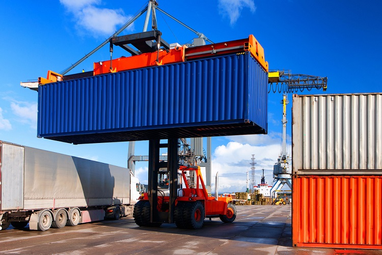

# Containers

## Defining Containers and Containerization
At a high-level, containers are a method of packaging software applications with all of their dependencies like the operating system (OS), file structures, configuration and other code libraries.

Containerization is the process of taking an application and modifying it to run in a container.

Containerizing applications allows a container runtime to run multiple containers in parallel without the applications and their dependencies conflicting with one another. 

A helpful analogy for these concepts is to think of the standard shipping container:

A shipping container has standardized dimensions and can be loaded with various contents. The contents of one container do not affect the contents of another container. These facts allow for trucks, cranes, ships and trains to load, transport and unload containers in a uniform manner. Shipping companies can transport containers from different companies with various products, so long as the products fit into a shipping container.

## Benefits of Containers
Containers offer many benefits but here we list a few of the most impactful ones: 

### 1. Isolated Runtime Environment
Each container runs in its own isolated environment which means that it can run alongside other apps without affecting them. 

For example, you could have two containerized applications "A" and "B" that both use the same library "Lib X." However, app A uses Lib X version 1.0 and app B uses version 2.0. If we were running these apps on the same computer without containerizing them we would have to install and configure some sort of environment management to make sure each app has access to the version of Lib X that it needs. Running these in a container frees us from the concern, as each app is packaged up with its own copy and version of Lib X.

### 2. Portability
Because containers are standardized, you can run a container on your laptop and, without modifying it, you can run the same container on the cloud.

### 3. Reproducability
Since containers are self-contained, you can easily share a copy of your container and allow others to run it and get the same output. This saves time as you can avoid having to troubleshoot running on different operating systems, having different library versions, using different file layouts, forgetting configuration steps etc.

## Running a Container
Containers don't run directly on your machine, but instead are executed by a container runtime. We will be considering [Docker](https://www.docker.com/) in the following examples, but there are alternatives such as [Singularity](https://sylabs.io/)

In addition to container runtimes, there are also container orchestration platforms, such as [Kubernetes](https://kubernetes.io/), which automate the lifecycle of containers such as deployment, scaling and maintaining containerized apps. For now we will focus on container runtimes.

### Installing Docker
If you'd like to get hands-on with the examples you can download and install [Docker Desktop](https://www.docker.com/products/docker-desktop/). Note: You may need admin credentials to do so on a work computer.

### Pulling an Image

### Checking Downloaded Images

### Starting a Container

### Deleting a Container

## Creating a Container

## Application to the Instructional Cluster

